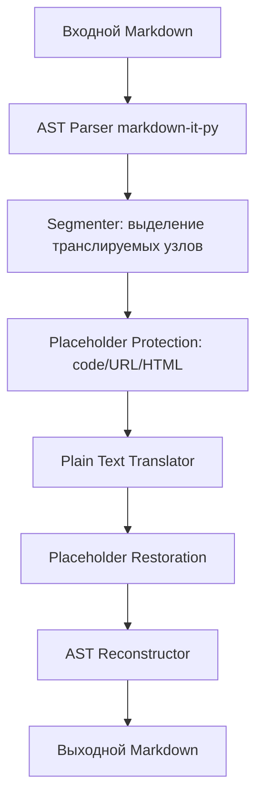

# NLLB Translation Server — Анализ кодовой базы и рекомендации к Этапу 3

**Дата:** 2026-05-27  
**Автор:** 🏗️ Architect Mode  
**Цель:** Подготовка к реализации Markdown-форматирования при переводе

---

## 1. Архитектурные проблемы

### 1.1 Блокировка event loop (Критично)

**Файл:** [`main.py`](nllb-server/src/mt_server/main.py:86)  
**Проблема:** Эндпоинт `translate_endpoint` объявлен как `async def`, но вызывает синхронный метод `translation_service.translate()`, который внутри использует `torch.inference_mode()` и `threading.Lock()`. Это блокирует весь asyncio event loop.

```python
@app.post("/translate", response_model=TranslateResponse)
async def translate_endpoint(request: TranslateRequest):
    # ...
    result = translation_service.translate(...)  # Блокирующий вызов!
```

**Решение:** Использовать `asyncio.to_thread()` или `run_in_executor()` для выноса блокирующих операций в отдельный поток.

---

### 1.2 Отсутствие Strategy pattern для форматов

**Файл:** [`translation_service.py`](nllb-server/src/mt_server/translation_service.py:43)  
**Проблема:** Используется `match/case` с `NotImplementedError` для Markdown. Нет расширяемой архитектуры для добавления новых форматов.

```python
match actual_format:
    case TextFormat.MARKDOWN:
        raise NotImplementedError("Markdown is not implemented yet")
    case _:
        return self.engine.translate(text, src_lang, tgt_lang)
```

**Решение:** Внедрить Strategy pattern — каждый формат имеет свой класс-переводчик, реализующий общий протокол.

---

### 1.3 Глобальное состояние без DI

**Файл:** [`main.py`](nllb-server/src/mt_server/main.py:37)  
**Проблема:** `translator_engine` и `translation_service` — глобальные переменные. Нет dependency injection, что затрудняет тестирование и мокирование.

```python
translator_engine: Optional[Translator] = None
translation_service: Optional[TranslationService] = None
```

**Решение:** Использовать FastAPI Depends() для внедрения зависимостей.

---

### 1.4 Некорректный путь к languages.json

**Файл:** [`languages.py`](nllb-server/src/mt_server/languages.py:5)  
**Проблема:** Путь `LANGUAGES_DB_FILE = "languages.json"` относительный и зависит от текущей рабочей директории.

```python
LANGUAGES_DB_FILE = "languages.json"  # Сломается при запуске из другой директории
```

**Решение:** Использовать `pathlib.Path(__file__).parent.parent.parent / "languages.json"`.

---

### 1.5 Несогласованность импортов

**Файлы:** [`utils.py`](nllb-server/src/mt_server/utils.py:9) vs остальные модули  
**Проблема:** `utils.py` использует абсолютные импорты (`from mt_server.config`), остальные — относительные (`from .config`).

**Решение:** Стандартизировать на относительных импортах внутри пакета.

---

### 1.6 Проблема с Dockerfile

**Файл:** [`Dockerfile`](nllb-server/Dockerfile:20)  
**Проблема:** `COPY *.py .` и `COPY *.json .` копируют файлы в `/app/`, но пакет находится в `src/mt_server/`. Файл `languages.json` может быть недоступен.

**Решение:** Явно копировать структуру `src/` и `languages.json`.

---

## 2. Проблемы с форматированием Markdown

### 2.1 Отсутствие системы защиты нетранслируемых элементов

**Контекст:** В [`mock_translator.py`](nllb-server/tests/mock_translator.py:8) упоминается `placeholders.py`, которого не существует.

**Требования:**
- Защита блоков кода (fenced и inline)
- Защита URL в ссылках
- Защита HTML-тегов
- Защита escape-последовательностей

**Решение:** Создать модуль `placeholders.py` с системой токенов-заменителей.

---

### 2.2 Отсутствие AST-сегментации

**Файл:** [`utils.py`](nllb-server/src/mt_server/utils.py:34)  
**Проблема:** Текущая сегментация по абзацам и предложениям разрушит Markdown-структуру:
- Заголовки станут предложениями
- Элементы списков будут объединены
- Таблицы будут разбиты

**Решение:** Использовать `markdown-it-py` для AST-парсинга и сегментации с сохранением структуры.

---

### 2.3 Требования из тестовых кейсов

| Тест | Требование |
|------|------------|
| `fenced-code` | Сохранять блоки кода без изменений |
| `links` | Переводить текст ссылки, сохранять URL и title |
| `images` | Переводить alt-текст, сохранять src и title |
| `escaped-markdown` | Сохранять escape-последовательности (`\*`, `\#`) |
| `yaml-frontmatter` | Сохранять YAML-структуру, опционально переводить значения |
| `whitespace-only` | Возвращать пустой/whitespace текст без изменений |

---

## 3. Технический долг

### 3.1 Закомментированный код

| Файл | Строки | Описание |
|------|--------|----------|
| [`main.py`](nllb-server/src/mt_server/main.py:91) | 91-95 | Валидация языков |
| [`diff.py`](nllb-server/tests/markdown/diff.py:31) | 31-34 | Старая реализация сравнения AST |

---

### 3.2 Нерешённые TODO

| Файл | Строка | Описание |
|------|--------|----------|
| [`utils.py`](nllb-server/src/mt_server/utils.py:40) | 40 | Fallback sentence regex |
| [`utils.py`](nllb-server/src/mt_server/utils.py:55) | 55 | Типизация tokenizer |
| [`engine.py`](nllb-server/src/mt_server/engine.py:95) | 95 | max_length в параметры |

---

### 3.3 Отсутствие типизации

**Файл:** [`engine.py`](nllb-server/src/mt_server/engine.py:72)  
Методы `get_supported_languages()` и `translate()` не имеют полных type hints.

---

### 3.4 Пустые/неиспользуемые артефакты

- [`__init__.py`](nllb-server/src/mt_server/__init__.py) — пустой, нет публичного API
- `mt_client/` — пустая директория

---

### 3.5 Побочные эффекты при импорте

**Файл:** [`languages.py`](nllb-server/src/mt_server/languages.py:26)  
Чтение файла происходит на уровне модуля при импорте — затрудняет тестирование.

---

## 4. Подготовка к Этапу 3: Архитектурные изменения

### 4.1 Предлагаемая архитектура

```
src/mt_server/
├── __init__.py              # Публичный API
├── config.py                # Конфигурация (pydantic-settings)
├── engine.py                # Translator (plain text)
├── translation_service.py   # Оркестратор
├── format_detection.py      # Определение формата
├── languages.py             # Языковая БД
├── utils.py                 # Утилиты сегментации
│
├── markdown/                # НОВЫЙ подпакет
│   ├── __init__.py
│   ├── translator.py        # MarkdownTranslator (Strategy)
│   ├── segmenter.py         # AST-сегментация
│   ├── placeholders.py      # Защита нетранслируемых элементов
│   └── reconstructor.py     # Сборка документа после перевода
│
└── protocols.py             # Общие интерфейсы (TranslatorProtocol)
```

---

### 4.2 Диаграмма потока данных для Markdown



---

### 4.3 Новые модули для создания

| Модуль | Назначение |
|--------|------------|
| `markdown/translator.py` | Координатор процесса Markdown-перевода |
| `markdown/segmenter.py` | Извлечение текстовых узлов из AST |
| `markdown/placeholders.py` | Замена нетранслируемых элементов на токены |
| `markdown/reconstructor.py` | Восстановление Markdown из переведённых узлов |
| `protocols.py` | Общие интерфейсы для всех переводчиков |

---

## 5. Рекомендации по рефакторингу (приоритизированные)

### P0 — Критично (блокирует Этап 3)

| # | Задача | Файл |
|---|--------|------|
| 1 | Создать `MarkdownTranslator` с Strategy pattern | Новый `markdown/translator.py` |
| 2 | Реализовать систему placeholder'ов | Новый `markdown/placeholders.py` |
| 3 | Реализовать AST-сегментацию | Новый `markdown/segmenter.py` |
| 4 | Исправить sync/async mismatch | `main.py`, `translation_service.py` |

---

### P1 — Высокий приоритет (надёжность)

| # | Задача | Файл |
|---|--------|------|
| 5 | Исправить путь к `languages.json` | `languages.py` |
| 6 | Стандартизировать импорты | Все модули |
| 7 | Добавить type hints | `engine.py` |
| 8 | Исправить Dockerfile COPY | `Dockerfile`, `Dockerfile.dev` |

---

### P2 — Средний приоритет (качество кода)

| # | Задача | Файл |
|---|--------|------|
| 9 | Удалить закомментированный код | `main.py`, `diff.py` |
| 10 | Закрыть TODO или создать issues | `utils.py`, `engine.py` |
| 11 | Мигрировать на pydantic-settings | `config.py` |
| 12 | Внедрить FastAPI Depends() | `main.py` |

---

### P3 — Низкий приоритет (гигиена)

| # | Задача | Файл |
|---|--------|------|
| 13 | Удалить пустую директорию `mt_client/` | — |
| 14 | Добавить публичный API в `__init__.py` | `__init__.py` |
| 15 | Вынести путь к модели в конфиг | `runner.py` |

---

## 6. Чек-лист готовности к Этапу 3

- [ ] Создан подпакет `markdown/`
- [ ] Реализован `MarkdownTranslator`
- [ ] Реализована система placeholder'ов
- [ ] Реализована AST-сегментация
- [x] Исправлена блокировка event loop
- [ ] Пройдены все тесты из `data/markdown-tests/`
- [ ] Обновлён `TranslationService` для делегирования
- [ ] Добавлена документация по архитектуре

---

## 7. Зависимости для Этапа 3

Уже установлены:
- `markdown-it-py>=4.2.0` — парсинг Markdown в AST
- `regex>=2026.5.9` — расширенные regex для placeholder'ов

Могут понадобиться:
- `pyyaml` — для YAML frontmatter (опционально)

---

*Конец отчёта*
